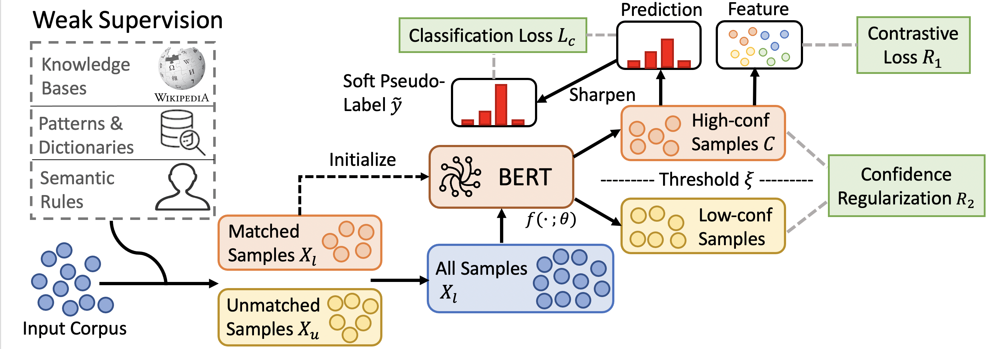

# COSINE
This repo contains our code for paper [Fine-Tuning Pre-trained Language Model with Weak Supervision: A Contrastive-Regularized Self-Training Approach](https://arxiv.org/abs/2010.07835) (arXiv preprint 2010.07835).

## Model Framework



## Benchmark
The results on different datasets are summarized as follows:

| Method | AGNews | IMDB | Yelp | MIT-R | TREC | Chemprot | WiC (dev) |
| ------ | ------- | ----- | ----------- | ------- | -------- | -------- | -------- | 
| Full Supervision (Roberta-base)  | 91.41 | 94.26 | 97.27 |  88.51 | 96.68 | 79.65 |  70.53 |
| Direct Fine-tune with Weak Supervision (Roberta-base) | 82.25 | 72.60 | 74.89 |  70.95 |  62.25 |  44.80 | 59.36 |
| Previous SOTA | 86.28 | 86.98 | 92.05 | 74.41 | 80.20 | 53.48 | 64.88 |
| COSINE | 87.52 | 90.54 | 95.97 | 76.61 | 82.59 | 54.36 | 67.71 | 

- *Previous SOTA*: [Self-ensemble](https://arxiv.org/abs/2002.10345)/[FreeLB](https://openreview.net/forum?id=BygzbyHFvB)[/Mixup](https://openreview.net/forum?id=r1Ddp1-Rb)/[SMART](https://www.aclweb.org/anthology/2020.acl-main.197/) (Fine-tuning Approach); [Snorkel](https://www.ncbi.nlm.nih.gov/pmc/articles/PMC5951191/)/[WeSTClass](https://arxiv.org/abs/1812.11270)/[ImplyLoss](https://openreview.net/forum?id=SkeuexBtDr)/[Denoise](https://arxiv.org/abs/2010.04582)/UST (Weakly-supervised Approach).


## Data

The weakly labeled datasets we used in our experiments are in here: [dataset](data). The statistics of dataset is summarized as follows:

| Dataset | AGNews | IMDB | Yelp | TREC | MIT-R | Chemprot | WiC (dev) |
| ------ | ------- | ----- | ----------- | ------- | -------- | -------- | -------- | 
| Type | Topic | Sentiment | Sentiment |  Slot Filling | Question | Relation |  Word Sense Disambiguation |
| # of Training Samples  | 96k | 20k |  30.4k |  6.6k | 4.8k | 12.6k |  5.4k |
| # of Validation Samples | 12k | 2.5k | 3.8k | 1.0k |  0.6k |    1.6k | 0.6k |
|# of Test Samples | 12k | 2.5k | 3.8k |  1.5k |  0.6k |  1.6k | 1.4k |
| Coverage | 56.4\%  |  87.5\% | 82.8\% | 13.5\% | 95.0\% | 85.9\%  | 63.4\%  |
| Accuracy | 83.1\% | 74.5\% | 71.5\% | 80.7\% | 63.8\% | 46.5\%  | 58.8\%  | 

## Package 
- PyTorch 1.2
- python 3.6
- Transformers v2.8.0
- tqdm

## Code
- `main.py`: the main code to run the self-training code.

- `dataloader.py`: the code to preprocess text data and tokenize it.

- `utils.py`: some code including calculating accuracy, saving data etc.

- `modeling_roberta.py`: the code to modify the basic Roberta model for our task (we need to directly output the feature vector for RoBERTa)

- `model.py`: the RoBERTa model for classfication tasks. See `BERT_model` for details.
  
- `trainer.py`: the code to training the RoBERTa under different settings.
   - `train(self)`: training for stage 1
   - `selftrain(self, soft = True)`: the code for self-training based on pseudo-labeling with period update. 
   - `soft_frequency`: the function to reweight the value of pseudo-labels based on [WESTClass](https://arxiv.org/abs/1812.11270).
   - `calc_loss`: Calculate the prediction loss for self-training.
   - `contrastive_loss`: Contrastive loss on sample pairs.

## Run the Code
Please use `run_agnews.sh` to run the code for AGnews dataset as an example.

## Key Parameters
For each model, we summarize the key parameters as follows (note that some parameters defined in the args are obsolete, and we will clean them up later): 
## General
 - use `--method` to determine the training method you use
    - `clean`: train on clean data
    - `noisy`: train directly on weakly labeled data
    - `selftrain`: self-training
- use `--task` to determine the dataset. Choice includes 'agnews', 'imdb', 'yelp', 'mit-r', 'trec', 'chemprot', 'wic'.
-  use `--task_type` to determine the training task. `tc` stands for text classification, 're' means relation classification.
-  use `--gpu` to allocate the GPU resource to speed up training.
- use `--max_seq_len` to determine the maximum number of tokens per sentences. 
- use `--auto_load` to automatically load the cached training data. Otherwise, we will regenerate the training/dev/test set
- Change code in `utils.py` to add special tokens (in line 26).

## For self-training-based model
  - Use `--self_training_eps` to determine the threshold for confidence. Usually set around 0.6-0.7.
  - Use `--self_training_power` to control the power for calculating pseudo labels.
  - Use `--self_training_contrastive_weight` to control the power for contrastive loss.
  - Use `--self_training_confreg` to control the power for confidence regularization.

## TODO:
 - Add token classification version of our framework.

## Citation

Please cite the following paper if you find our datasets/tool are useful. Thanks!

```
@article{yu2020finetuning,
  title={Fine-Tuning Pre-trained Language Model with Weak Supervision: A Contrastive-Regularized Self-Training Approach},
  author={Yu, Yue and Zuo, Simiao and Jiang, Haoming and Ren, Wendi and Zhao, Tuo and Zhang, Chao},
  journal   = {CoRR},
  volume    = {abs/2010.07835},
  year={2020},
  url       = {http://arxiv.org/abs/2010.07835},
  archivePrefix = {arXiv},
}
```
